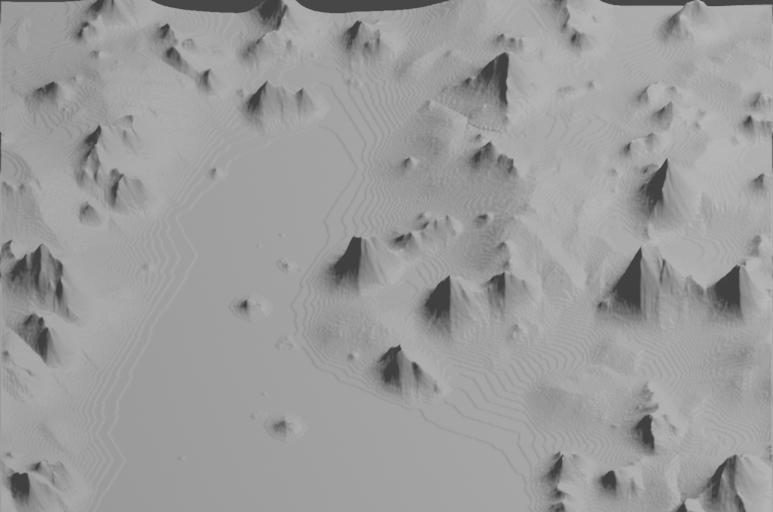

# MapApp

Sovellus pyrkii olemaan karttageneraattori roolipelikampanjoita varten. Se tuottaa pelikelpoisia karttoja erilaisten kohinamallien ja eroosion simuloimisen avulla.

# Arkkitehtuuridiagrammi

[Arkkitehtuuridokumentti](dokumentaatio/arkkitehtuuri.md)

# Työaikakirjanpito

[Työaikakirjanpito](dokumentaatio/Työaikakirjanpito.md)

# Vaatimusmäärittely

[Vaatimusmäärittely](dokumentaatio/vaatimusmäärittely.md)

# Ohjelman suoritus

Yliopiston koneilla olen saanut ohjelman suorittumaan TMC-beansin vihreällä namiskalla ja käsivääntöisemmin kahdella komennolla:

```
mvn package
java -jar target/MapApp-1.0-SNAPSHOT.jar
```

Suorempi lähestymistapa tuntui toimineen omalla NixOS-läppärillä:

```mvn compile exec:java -Dexec.mainClass=ui.Main```

Ohjelman suorituksessa sen tarjoamilla oletusasetuksilla kestää minun koneellani osapuilleen kaksi minuuttia. Ohjelma antaa väliakatiedotetta laskennan edistymisestä eli on helppo nähdä onko se kaatunut. Ulos tuleva korkeuskartta ei välttämättä ole kummoinen, mutta sen projektio 3D-tasoksi on kiintoisa. (Tein tämän Blenderillä) Tässä on esimerkki oletusarvoilla ja siemenarvolla `1337` syntyvän tuloksen projektio:



# Testien suoritus ja Jacoco

Testien pitäisi suorittua yksinkertaisesti `mvn test` -loitsulla. Omalla koneellani tähän kuluu kymmenisen sekuntia ja etäpalvelimella viitisentoista. Jacoco suorittuu komennolla `mvn test jacoco:report`.


