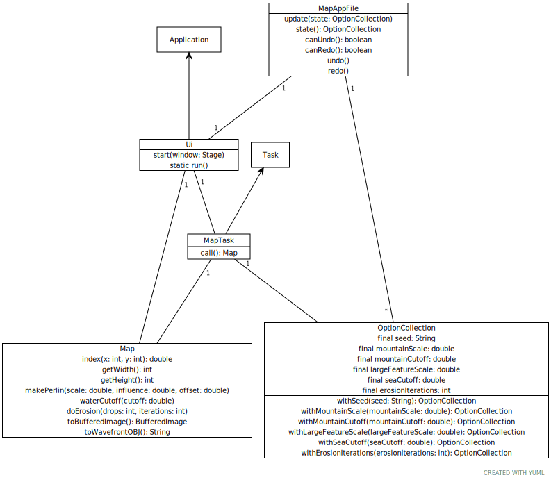
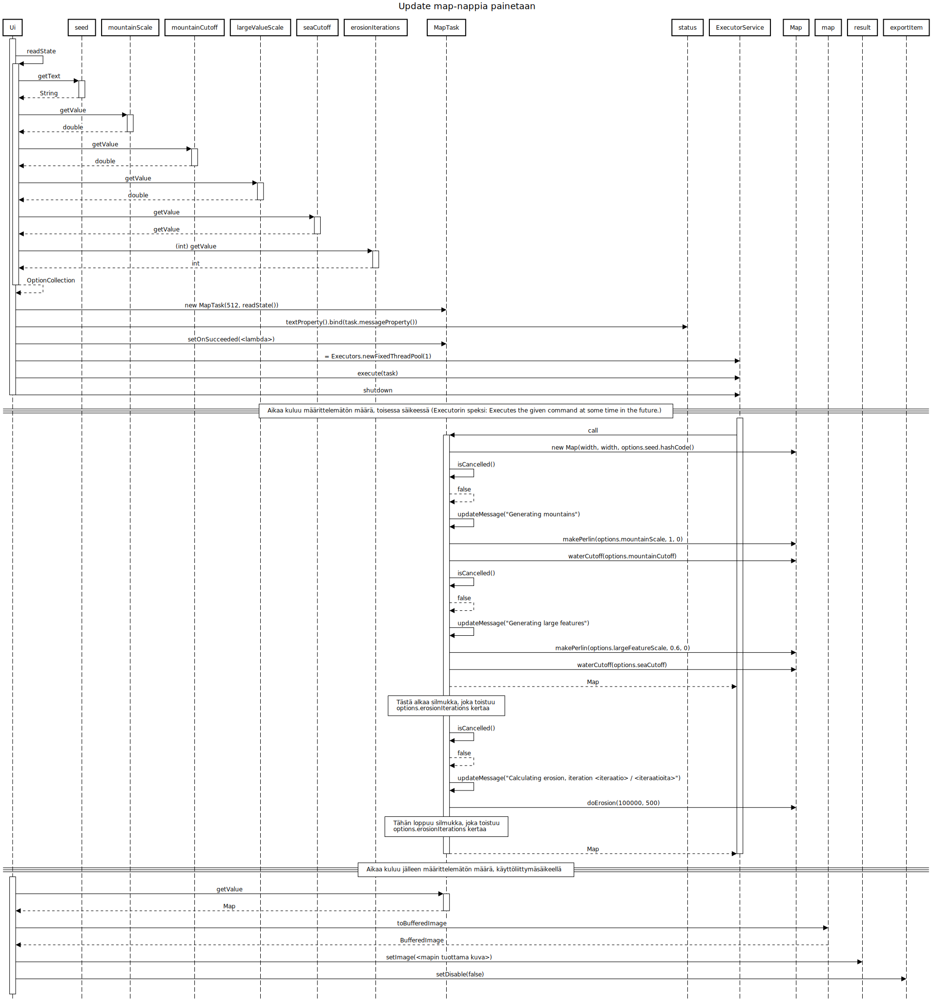

<!--

[Application]<-[Ui||start(window: Stage); static run()]1--[Map||index(x: int, y: int): double; getWidth(): int; getHeight(): int; makePerlin(scale: double, influence: double, offset: double); waterCutoff(cutoff: double); doErosion(drops: int, iterations: int); toBufferedImage(): BufferedImage]

[Task]<-[MapTask||call(): Map]1--[Map]
[Ui]1--[MapTask]
[OptionCollection|final seed: String; final mountainScale: double; final mountainCutoff: double; final largeFeatureScale: double; final seaCutoff: double; final erosionIterations: int|withSeed(seed: String): OptionCollection; withMountainScale(mountainScale: double): OptionCollection; withMountainCutoff(mountainCutoff: double): OptionCollection; withLargeFeatureScale(largeFeatureScale: double): OptionCollection; withSeaCutoff(seaCutoff: double): OptionCollection; withErosionIterations(erosionIterations: int): OptionCollection]

[MapAppFile|update(state: OptionCollection); state(): OptionCollection; canUndo(): boolean; canRedo(): boolean; undo(); redo()]

[MapAppFile]1-*[OptionCollection]

[MapAppFile]1-1[Ui]

[MapTask]1-[OptionCollection]

-->
