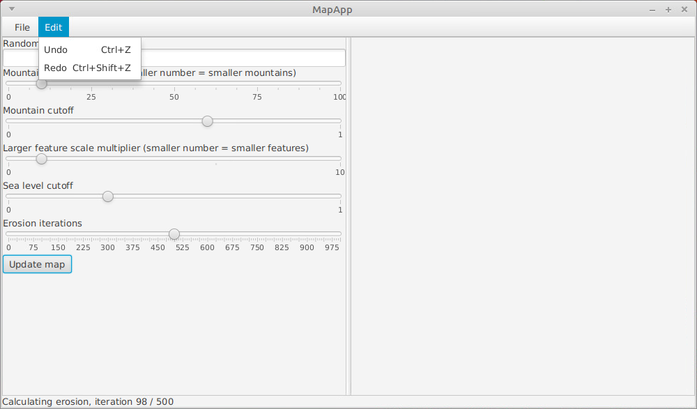

# Käyttöohje

Lataa suoritettava `.jar`-tiedosto releases-välilehdeltä tai kloonaa repositorio ja luo suoritettava `.jar` tiedosto itse `MapApp`-kansiosta komennolla

```
mvn package
```

## Ohjelman käynnistäminen

Ohjelma käynnistetään komennolla

```
java -jar <suoritettava .jar-tiedosto>
```

Jos loit suoritettavan `.jar`-tiedoston itse, niin komento on

```
java -jar target/MapApp*.jar
```

## Kartan asetukset

Kun sovellus käynnistetään niin näkyvä tulos on:


Ikkunan vasemmalla puolella on joukko asetuksia, joilla karttaa saa muokattua. Asetuksia vastaavan kartan saa näkymään oikealle painamalla `Update map`-painiketta. Tässä voi kestää hetki. Laskennan etenemisestä näkyy tietoa ohjelman alalaidassa. Yllä näkyvillä asetuksilla saadaan tällainen kartta:


### Siemenarvo

Säätämällä `Random seed`-asetusta voidaan vaihtaa kartan maastomuotoja vaihtamatta merenpinnan tason tai vuorien korkeuden kaltaisia yleisiä ominaisuuksia.

Vaihtamalla siemenarvoksi `kissa123` saatiin seuraava kartta.


### Vuorten mittakaava

Säätämällä `Mountain scale multiplier`-asetusta voidaan tehdä vuorista pienempiä tai suurempia. Viidenkympin tienoilla syntyy seuraavaa tulosta:


### Maamassojen mittakaava

Säätämällä `Large feature scale multiplier`-asetusta voidaan tuottaa suurempia tai pienempiä maamassoja.


### Merenpinnan taso

Säätämällä `Sea level cutoff`-asetusta voidaan tuottaa karttoja, joissa on enemmän tai vähemmän merialueita. Kuvan asetuksilla saadaan aikaan eristettyjä pieniä saaria.


### Eroosion määrä

Säätämällä `Erosion iterations`-asetusta voidaan tuottaa vanhoja ja kuluneita vuoristoja tai juuri poimuttuneita ja ryppyisiä maastomuotoja. __Eroosion laskeminen on selvästi pisimmän ajan vievä osa laskentaa__, joten kanattaa prototypoida niin, ettei eroosio ole päällä. Oletuskartta näyttää tältä, kun eroosion ottaa pois:


## Muokkausvalikko

MapAppissä on perumis- ja toistamistoiminnot pitkälti siten kuin odottaa saattaisi:



## Tiedostovalikko


`Open map` ja `Save map` -asetukset antavat luoda ja ladata työtiedostoja. `Export map (.PNG)`-asetus tallentaa oikealla näkyvän korkeuskartan ja `Export map (.OBJ)` tallentaa karttaa vastaavan 3D-mallin `.OBJ`-tiedostona. MapApp ei pakota päätettä tiedostoa tallentaessa.

OBJ-tiedosto on sellainen, ettei sitä saa laitoksen koneilla esikatseltua suoraan. [Esimerkiksi tällä nettikilkkeellä](http://masc.cs.gmu.edu/wiki/ObjViewer) se kuitenkin onnistuu helposti.
