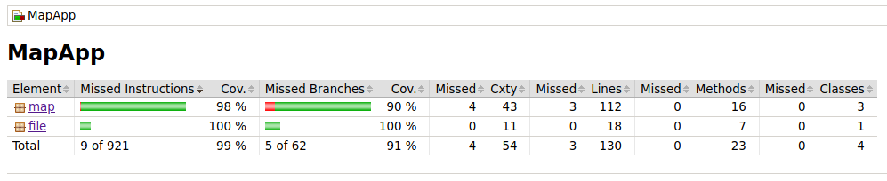

# Testausdokumentti

Olen testannut ohjelmaa JUnitilla ja käsin. Käsin olen kokeillut käyttöliittymän ja JUnitilla kaiken muun. Koska alemman tason toiminnallisuutta (joka elää pitkälti tiedostossa Map) käytetään tilattomasti MapTask-olion kautta, MapTaskin yksikkötestit toimivat samalla integraatiotestien omaisina. (Ne yhdistävät Map ja OptionCollection -olioiden testaamista.)

## Testauskattavuus

Käyttöliittymäluokkia ei testata automaattisesti. Rivikattavuus on 99% ja haarautumakattavuus 91%. Tämä johtuu siitä, että MapTaskissa on asetus, jolla sen saa testaustilaan. Testaustilassa MapTask ei kutsu updateMessage-metodia. Näin MapTaskia voi käyttää ilman JavaFXn tapahtumanhallintaa. Testaamattomat rivit ovat ne, joilla päivitysviestit lähetetään.

## Järjestelmätestaus

Järjestelmän tasolla olen testannut sovellusta käsin.

### Asennus ja kompilointi

Näitä vaiheita on testattu käsin sekä omalla laitteella (NixOS), että laitoksen VDI-etävirtualisaation alla (Cubbli).

### Toiminnallisuudet

Kaikkea määrittelydokumentista löytyvää on testattu käsin. Sinänsä virheellisen tiedon syöttäminen on vaikeaa, koska itse käyttöliittymässä on pelkästään siemenarvon syöttö ja liukusäätimiä. Ainut suora käyttäjävirhe, jonka keksin, on tiedoston tallentaminen tai lukeminen epäkelvolla sijainnilla (esim. niin, että tiedosto on toisen käyttäjän kotihakemistossa). Tämäkin on testattu ja siihen varauduttu.

### Parannettavaa

Voisi olla hyvä testata käyttöliittymää automaattisesti. Tähän ei kuitenkaan ollut aikaa ja energiaa.
